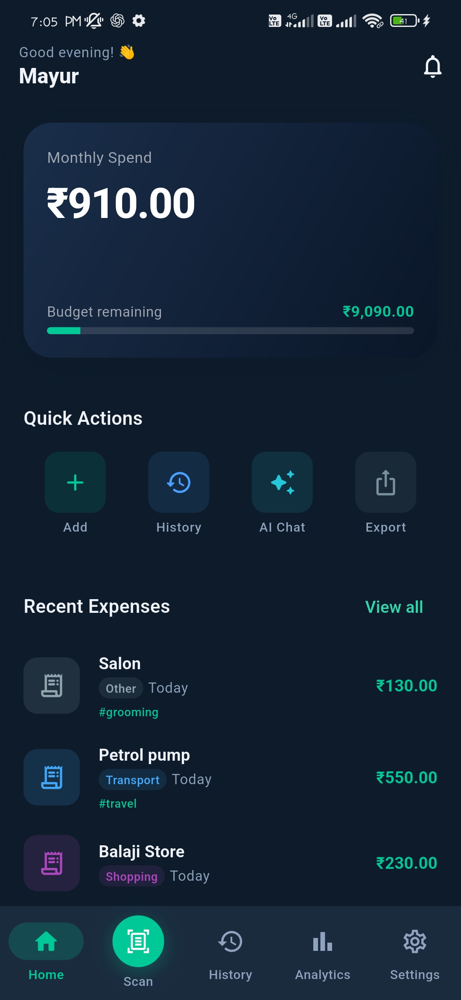
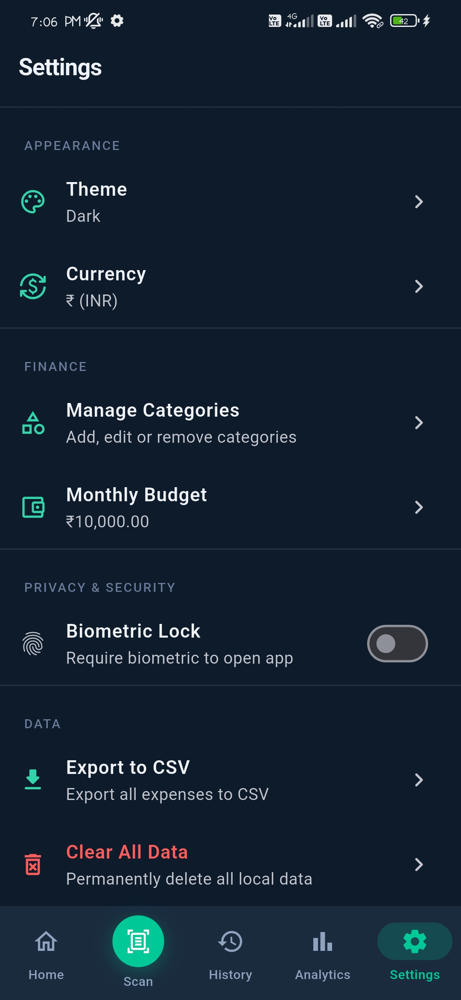

# 💸 AI Expense Scanner

A modern AI-powered Flutter expense tracker that scans receipts, extracts expense details using OCR, and provides smart financial insights through a Gemini-powered assistant.

> **Built with Flutter • Riverpod • GoRouter • Drift (SQLite) • Firebase Authentication • Google ML Kit OCR**

---

## ✨ Features

- 📸 AI Receipt Scanner with OCR
- 🤖 Gemini AI Financial Assistant
- 📊 Beautiful Analytics Dashboard
- 💰 Expense Management
- 🔍 Duplicate Expense Detection
- 🔐 Google Sign-In & Firebase Phone OTP
- 📱 Modern Material 3 UI
- 💾 Offline-first with Drift (SQLite)

---

## 📱 Screenshots

### Splash Screen


### Google Sign-In


### Dashboard


### Add Expense


### Expense Details


### AI Assistant (Gemini Chat)


### Analytics Dashboard


### Settings


---

## 🏗️ Tech Stack

| Category | Technology |
|----------|------------|
| Framework | Flutter |
| Language | Dart |
| State Management | Riverpod |
| Navigation | GoRouter |
| Local Database | Drift (SQLite) |
| Authentication | Firebase Auth |
| OCR | Google ML Kit |
| AI | Gemini |
| Charts | fl_chart |
| Animations | flutter_animate |

---

## 🚀 Getting Started

### Prerequisites

- Flutter SDK
- Android Studio or VS Code
- Android Emulator or Physical Device
- Firebase Project

### Installation

```bash
git clone https://github.com/your-username/ai_expense_scanner.git

cd ai_expense_scanner

flutter pub get

flutter run
```

---

## 🔥 Firebase Setup

1. Create a Firebase project.
2. Register the Android app.
3. Download `google-services.json`.
4. Place it inside:

```text
android/app/google-services.json
```

5. Add SHA-1 and SHA-256 fingerprints.
6. Enable:
   - Google Sign-In
   - Phone Authentication

---

## 📂 Project Structure

```text
lib/
├── core/
│   ├── constants/
│   ├── database/
│   ├── router/
│   └── services/
├── features/
│   ├── auth/
│   ├── dashboard/
│   ├── expenses/
│   ├── scanner/
│   ├── ai_assistant/
│   ├── analytics/
│   └── settings/
└── main.dart
```

---

## 🎯 Upcoming Improvements

- Receipt auto edge detection
- Smart budget recommendations
- Export to PDF & Excel
- Multi-device sync
- Dark/Light theme customization
- Voice expense entry
- Monthly financial reports

---

## 📖 License

This project is licensed under the MIT License.

---

## 👨‍💻 Developer

**Mayur**

Built with ❤️ using Flutter and AI.